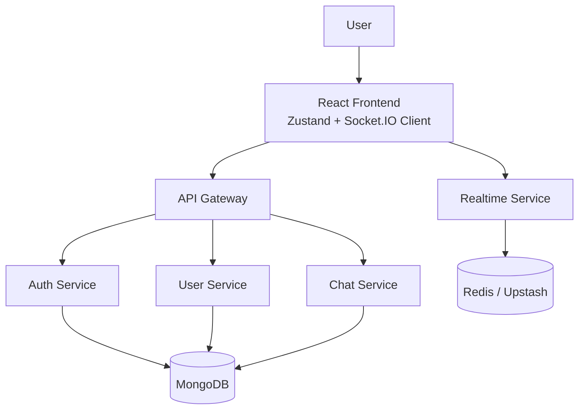
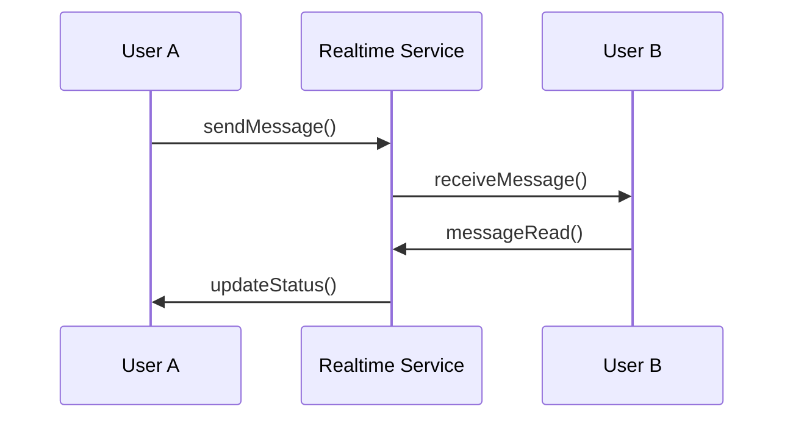
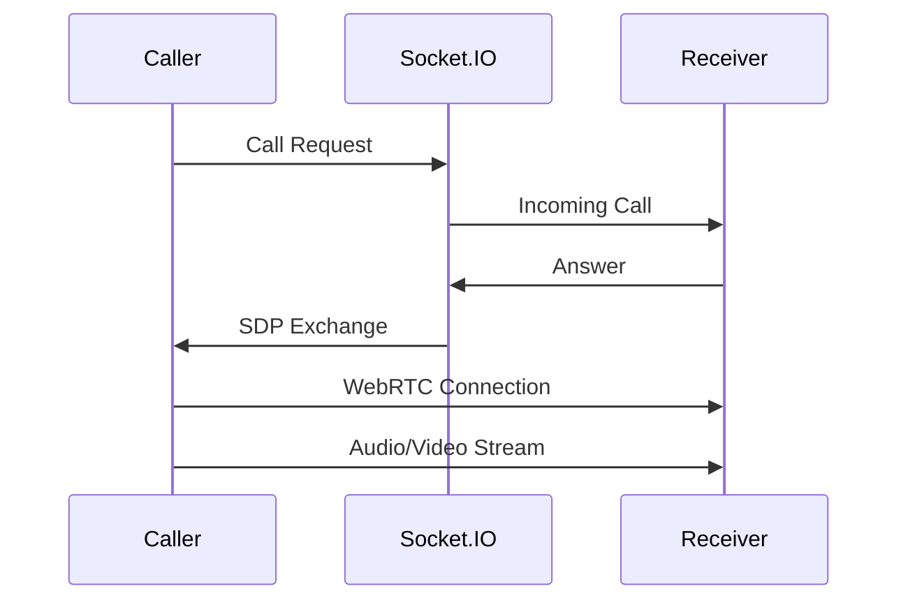
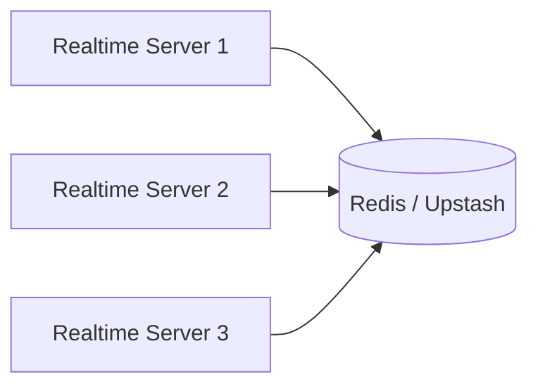

# 💬 Scalable Real-Time Chat Application

## Microservices-Based Communication Platform Using MERN Stack, Socket.IO, WebRTC, Redis & Upstash

<p align="center">
  
</p>

<p align="center">

A production-oriented real-time communication platform built with a scalable microservices architecture, enabling instant messaging, presence tracking, typing indicators, message delivery status, notifications, and peer-to-peer audio/video communication.

</p>

<p align="center">


</p>

---

# 📑 Table of Contents

* [Overview](#-overview)
* [Project Vision](#-project-vision)
* [Key Highlights](#-key-highlights)
* [Features](#-features)
* [System Architecture](#-system-architecture)
* [Microservices Architecture](#-microservices-architecture)
* [Real-Time Communication](#-real-time-communication)
* [WebRTC Calling Architecture](#-webrtc-calling-architecture)
* [Redis & Upstash Integration](#-redis--upstash-integration)
* [Technology Stack](#-technology-stack)

---

# 📖 Overview

Modern communication platforms require systems that can handle:

* Thousands of concurrent users
* Low-latency message delivery
* Reliable connection management
* Distributed backend processing
* Real-time state synchronization

This project implements a:

> **Scalable Microservices-Based Real-Time Chat Application built using MERN Stack, Socket.IO, WebRTC, Redis and Upstash.**

The platform provides a complete communication ecosystem where users can:

* Exchange instant messages
* Track online/offline presence
* Receive real-time notifications
* View typing activity
* Track message delivery status
* Search users
* Manage profiles
* Perform audio calls
* Perform video calls

Unlike traditional monolithic applications, this system follows a distributed architecture where every major responsibility is isolated into independent services.

---

# 🎯 Project Vision

The goal of this project is to design a production-level communication platform demonstrating modern backend engineering practices:

## 1. Scalable Microservices Architecture

Instead of a single backend application, the system is divided into independent services.

Benefits:

* Independent development
* Independent deployment
* Better fault isolation
* Easier maintenance
* Horizontal scalability

---

## 2. Real-Time Communication Engine

The application implements a low-latency communication layer using:

```
Socket.IO
     +
WebSocket Communication
     +
Redis Synchronization
```

This enables:

* Instant message delivery
* Presence tracking
* Typing indicators
* Notifications
* Live application updates

---

## 3. Modern Frontend Architecture

The frontend follows a scalable React architecture using:

```
React.js
+
Zustand
+
Socket.IO Client
+
WebRTC
```

Providing:

* Reactive UI updates
* Centralized state management
* Real-time synchronization
* Optimized user experience

---

## 4. Peer-to-Peer Communication

Audio and video communication is implemented using:

```
WebRTC
+
Socket.IO Signaling
```

Supporting:

* Browser-based calling
* Peer connections
* Real-time media streaming

---

# 🚀 Key Highlights

## Enterprise-Level Architecture

* Microservices-based backend
* API Gateway pattern
* Independent service communication
* Container-ready deployment

## Real-Time Features

* Instant messaging
* Online/offline status
* Typing indicators
* Read receipts
* Live notifications

## Communication Features

* Audio calling
* Video calling
* WebRTC peer connection
* Real-time signaling

## Performance Features

* Redis-based synchronization
* Optimized socket handling
* Distributed communication support

## Security Features

* JWT authentication
* Password hashing
* Protected APIs
* Token validation

---

# ✨ Features

# 🔐 Authentication System

A secure authentication module responsible for user identity management.

## Capabilities

* User registration
* Secure login
* JWT authentication
* Password encryption
* Protected routes

Authentication Flow:

```
User Credentials

        |

        ▼

Authentication Service

        |

        ▼

Password Verification

        |

        ▼

JWT Generation

        |

        ▼

Authenticated Session
```

Security Implementation:

| Feature            | Technology         |
| ------------------ | ------------------ |
| Authentication     | JWT                |
| Password Security  | bcrypt             |
| Authorization      | Middleware         |
| Session Validation | Token Verification |

---

# 💬 Real-Time Private Messaging

The core communication engine enables users to exchange messages instantly.

Features:

* One-to-one messaging
* Conversation history
* Instant delivery
* Message persistence
* Message lifecycle tracking

Message Flow:

```
Sender

   |

   |

Socket Event

   |

   |

Realtime Service

   |

   |

Receiver
```

Message Lifecycle:

```
Created

 ↓

Stored

 ↓

Delivered

 ↓

Read
```

---

# 🟢 Online Presence System

The application tracks user availability in real-time.

Supported states:

```
🟢 Online

⚫ Offline

⌨️ Typing
```

The realtime layer manages:

* Active socket connections
* User connection mapping
* Presence updates
* Connection lifecycle

---

# ✍️ Typing Indicator

Users receive instant typing feedback.

Example:

```
User A is typing...
```

Implementation:

```
Typing Event

      |

      ▼

Socket.IO

      |

      ▼

Receiver UI Update
```

---

# ✅ Message Status Tracking

The system supports modern messaging indicators:

```
Sent

 ↓

Delivered

 ↓

Read
```

This provides WhatsApp-style message tracking.

---

# 🔔 Real-Time Notifications

The notification system provides instant updates for:

* New messages
* Incoming calls
* User activity

Flow:

```
Event Trigger

      |

      ▼

Realtime Service

      |

      ▼

Notification Event

      |

      ▼

Frontend Update
```

---

# 🔎 User Discovery System

Users can discover other users through search.

Features:

* Username search
* Profile-based search
* Dynamic results

Flow:

```
Search Query

      |

      ▼

User Service

      |

      ▼

Matching Users
```

---

# 👤 Profile Management

Users can manage their profile information.

Features:

* View profile
* Update details
* Profile image support
* Personal information management

---

# 📞 Audio Calling

The platform supports browser-based real-time audio communication.

Technology:

```
WebRTC
+
Socket.IO Signaling
```

Features:

* Call initiation
* Call acceptance
* Peer connection
* Audio streaming

---

# 🎥 Video Calling

Video communication is implemented using WebRTC.

Features:

* Camera streaming
* Microphone access
* Peer-to-peer media transfer
* Call controls

Architecture:

```
User A

   |

   |

WebRTC Peer Connection

   |

   |

User B
```

---

# 🏗 System Architecture

The application follows a distributed microservices architecture.

<p align="center">

</p>

## High-Level Architecture



---

# 🧩 Microservices Architecture

The backend is divided into five independent services:

```
Backend

│

├── API Gateway

│

├── Authentication Service

│

├── User Service

│

├── Chat Service

│

└── Realtime Service
```

Each service has a dedicated responsibility.

Advantages:

* Better scalability
* Service isolation
* Easier debugging
* Independent deployment
* Improved maintainability

---

# 🚪 API Gateway Service

## Purpose

The API Gateway acts as the single entry point between frontend and backend services.

Instead of directly connecting with every backend service, the frontend communicates through the gateway.

Architecture:

```
Frontend

    |

    |

API Gateway

    |

-----------------------

|        |       |

Auth    User    Chat

Service Service Service
```

Responsibilities:

* Request routing
* Service communication
* API abstraction
* Centralized access layer

Technology:

```
Node.js
Express.js
Axios
```

---

# 🔐 Authentication Service

Responsible for identity and security management.

Responsibilities:

* User registration
* Login processing
* JWT generation
* Password encryption
* Authentication validation

Technology:

```
JWT
bcrypt
MongoDB
```

---

# 👤 User Service

Responsible for user-related operations.

Handles:

* User profiles
* Profile updates
* User search
* User discovery

---

# 💬 Chat Service

Responsible for message management.

Handles:

* Message storage
* Conversation management
* Message retrieval
* Chat history

---

# ⚡ Real-Time Service

The core communication engine.

Responsible for:

* Socket.IO connections
* Online presence
* Typing events
* Message delivery
* Notifications
* WebRTC signaling

---

# ⚡ Real-Time Communication Architecture

The application maintains persistent socket connections between clients and the realtime service.

Architecture:



---

# 📞 WebRTC Calling Architecture

WebRTC handles direct peer-to-peer media communication.

Socket.IO is only responsible for signaling.

Architecture:



---

# 🔴 Redis & Upstash Integration

Redis provides high-speed in-memory data operations.

The project uses Redis for:

* Real-time state synchronization
* Socket scaling
* Distributed communication
* Fast data access

Architecture:



Benefits:

## Scalability

Multiple realtime instances can share common state.

## Performance

Provides:

* Low latency
* Fast reads
* Efficient event synchronization

## Distributed Communication

Enables future horizontal scaling.

---

# 🛠 Technology Stack

## Frontend Stack

| Technology       | Purpose                 |
| ---------------- | ----------------------- |
| React.js         | User interface          |
| Zustand          | Global state management |
| Tailwind CSS     | Styling                 |
| Socket.IO Client | Real-time communication |
| WebRTC           | Audio/video calling     |
| Axios            | API communication       |
| React Router     | Routing                 |

---

## Backend Stack

| Technology | Purpose               |
| ---------- | --------------------- |
| Node.js    | Runtime               |
| Express.js | API development       |
| Socket.IO  | Real-time events      |
| MongoDB    | Database              |
| Mongoose   | ODM                   |
| JWT        | Authentication        |
| bcrypt     | Password security     |
| Axios      | Service communication |

---

## Infrastructure Stack

| Technology     | Purpose               |
| -------------- | --------------------- |
| Microservices  | Backend architecture  |
| API Gateway    | Request routing       |
| Redis          | Distributed state     |
| Upstash        | Cloud Redis           |
| Docker         | Containerization      |
| Docker Compose | Service orchestration |

---

**End of Part 1**

Part 2 में:

* Complete folder structure
* Database schema
* API documentation
* Socket events
* Environment setup
* Docker deployment
* Security
* Scalability improvements
* Future roadmap
* Author section
  शामिल होंगे।
